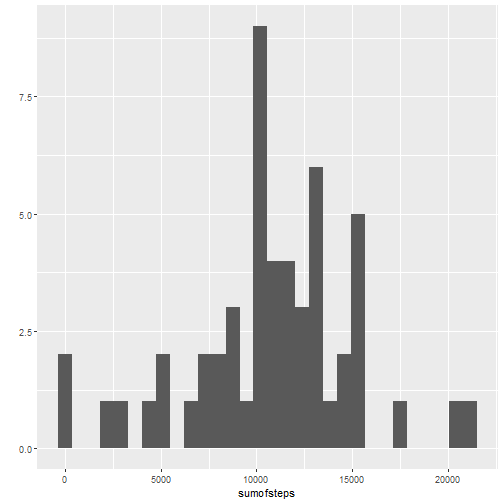
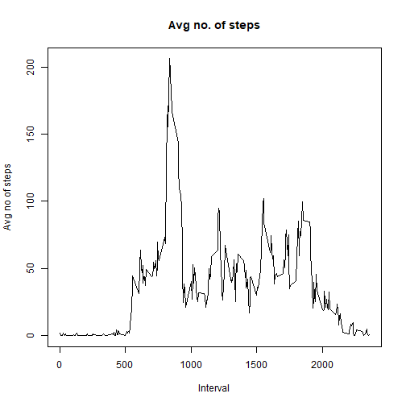
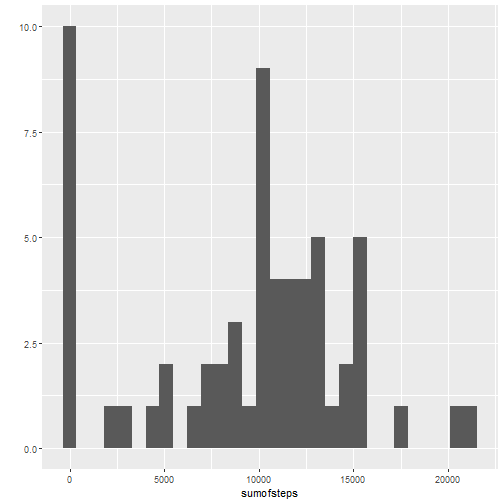
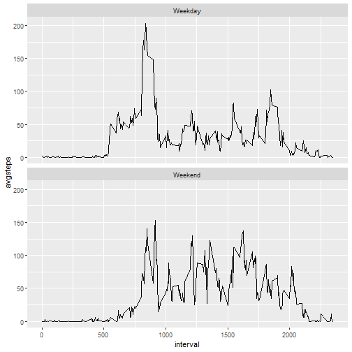

load relevant packages

```r
library(ggplot2)
library(dplyr)
library(knitr)
```

read the relevant file into R and create new table q1 with sum of steps

```r
activity <- read.csv("activity.csv")
q1 <- aggregate(activity$steps, by=list(date=activity$date),FUN=sum,na.rm=TRUE)
colnames(q1)<-c("date","sumofsteps")
```

## Part1 Q1) Total steps taken per day is shown in table below:

```r
q1
```

```
##          date sumofsteps
## 1  2012-10-01          0
## 2  2012-10-02        126
## 3  2012-10-03      11352
## 4  2012-10-04      12116
## 5  2012-10-05      13294
## 6  2012-10-06      15420
## 7  2012-10-07      11015
## 8  2012-10-08          0
## 9  2012-10-09      12811
## 10 2012-10-10       9900
## 11 2012-10-11      10304
## 12 2012-10-12      17382
## 13 2012-10-13      12426
## 14 2012-10-14      15098
## 15 2012-10-15      10139
## 16 2012-10-16      15084
## 17 2012-10-17      13452
## 18 2012-10-18      10056
## 19 2012-10-19      11829
## 20 2012-10-20      10395
## 21 2012-10-21       8821
## 22 2012-10-22      13460
## 23 2012-10-23       8918
## 24 2012-10-24       8355
## 25 2012-10-25       2492
## 26 2012-10-26       6778
## 27 2012-10-27      10119
## 28 2012-10-28      11458
## 29 2012-10-29       5018
## 30 2012-10-30       9819
## 31 2012-10-31      15414
## 32 2012-11-01          0
## 33 2012-11-02      10600
## 34 2012-11-03      10571
## 35 2012-11-04          0
## 36 2012-11-05      10439
## 37 2012-11-06       8334
## 38 2012-11-07      12883
## 39 2012-11-08       3219
## 40 2012-11-09          0
## 41 2012-11-10          0
## 42 2012-11-11      12608
## 43 2012-11-12      10765
## 44 2012-11-13       7336
## 45 2012-11-14          0
## 46 2012-11-15         41
## 47 2012-11-16       5441
## 48 2012-11-17      14339
## 49 2012-11-18      15110
## 50 2012-11-19       8841
## 51 2012-11-20       4472
## 52 2012-11-21      12787
## 53 2012-11-22      20427
## 54 2012-11-23      21194
## 55 2012-11-24      14478
## 56 2012-11-25      11834
## 57 2012-11-26      11162
## 58 2012-11-27      13646
## 59 2012-11-28      10183
## 60 2012-11-29       7047
## 61 2012-11-30          0
```

form a new table q2 which only includes sum of steps per day of more than 0.

```r
q2 <- filter(q1,q1$sumofsteps>0)
```

## Part1 Q2) Histogram of total number of steps taken:

```r
qplot(sumofsteps,data=q2)
```

```
## `stat_bin()` using `bins = 30`. Pick better value with `binwidth`.
```



calculating the mean and median for number of steps per day and storing under q2mean and q2median respectively

```r
q2mean <- mean(q2$sumofsteps)
q2median <- median(q2$sumofsteps)
```

## Part1 Q3) The mean is 1.0766189 &times; 10<sup>4</sup> and the median is 10765.

create a table called "avgsteps" to show mean of steps per time interval over all days

```r
avgsteps <- aggregate(activity$steps, by=list(interval=activity$interval),FUN=mean,na.rm=TRUE)
```

## Part2 Q1) Time series plot of the 5 minute interval and average number of steps taken, averaged across all days is shown below:

```r
plot(avgsteps$interval,avgsteps$x, type='l', main = "Avg no. of steps", xlab = "Interval", ylab = "Avg no of steps")
```



create q4 to store the maximum number of steps

```r
q4<-filter(avgsteps,avgsteps$x == max(avgsteps$x))
colnames(q4) <- c("interval","avgsteps")
```

## Part2 Q2) The 5-minute interval, on average across all the days in the dataset that contains the maximum number of steps is presented in the table below:

```r
q4
```

```
##   interval avgsteps
## 1      835 206.1698
```

## Part3 Q1) The total number of missing values in dataset is:

```r
sum(is.na(activity))
```

```
## [1] 2304
```

## Part3 Q2) My strategy to fill in missing values in dataset is to use the average steps for that day to fill in the missing values

create q5 which is same as the original dataset so as not to accidentally alter the original dataset

```r
q5 <- activity
```

create table "q5avgbydate" which stores the daily average steps

```r
q5avgbydate <- aggregate(q5$steps,by=list(q5$date),FUN=mean,na.rm=TRUE)
colnames(q5avgbydate) <- c("date","avgsteps")
```

change all NaN values in "q5avgbydate" to 0

```r
i=1
for(i in 1:61){
  if(q5avgbydate[i,2] == "NaN") {
    q5avgbydate[i,2] <- 0}
  i=i+1
}
```

create a table "q5mirror" to merge the data in q5avgbydate to q5, then create another table "q5a" that changes all NA to the respective average steps in the respective date.

```r
q5mirror <- merge(q5,q5avgbydate,by.x="date",by.y="date",all=TRUE)
q5a <- q5
a=1
for(a in 1:17568){
  if(is.na(q5a[a,1])){
    q5a[a,1] <- q5mirror[a,4]}
  a=a+1
}
```

## Part3 Q3) New dataset that is equal to the original dataset but with the missing data filled in is shown here (only showing head due to large size):

```r
head(q5a)
```

```
##   steps       date interval
## 1     0 2012-10-01        0
## 2     0 2012-10-01        5
## 3     0 2012-10-01       10
## 4     0 2012-10-01       15
## 5     0 2012-10-01       20
## 6     0 2012-10-01       25
```

create a table called "q5b" that shows the sum of steps grouped by date, also store the mean and median in q5mean and q5median respectively.

```r
q5b <- aggregate(q5a$steps, by=list(date=q5a$date),FUN=sum,na.rm=TRUE)
colnames(q5b)<-c("date","sumofsteps")
q5mean <- mean(q5b$sumofsteps)
q5median <- median(q5b$sumofsteps)
```

## Part3 Q4) For total number of steps taken per day, the mean is 9354.2295082 and median is 1.0395 &times; 10<sup>4</sup>. When compared to first part where mean is 1.0766189 &times; 10<sup>4</sup> and median is 10765, the values are lower for both the new mean and new median. The impact of imputing the missing data on the estimates of total daily number of steps lowered the mean and medium. The histogram of total number of steps taken each day is shown below:

```r
qplot(sumofsteps,data=q5b)
```

```
## `stat_bin()` using `bins = 30`. Pick better value with `binwidth`.
```



create a table called q6 which is generated from q5avgbydate as q5avgbydate has unique date column. q6 will then show the day of the week for the corresponding dates.

```r
q6<-q5avgbydate
b=1
for(b in 1:61){
  q6[b,2]<-weekdays(as.Date(q6[b,1]))
  b=b+1
}
colnames(q6) <- c("date","day")
```

create a table "daytype" to show which days of the week is weekday and which days of the week is weekend

```r
daytype <- matrix(nrow = 7, ncol = 2)
daytype[1,1]<-"Monday"
daytype[2,1]<-"Tuesday"
daytype[3,1]<-"Wednesday"
daytype[4,1]<-"Thursday"
daytype[5,1]<-"Friday"
daytype[6,1]<-"Saturday"
daytype[7,1]<-"Sunday"
daytype[1,2]<-"Weekday"
daytype[2,2]<-"Weekday"
daytype[3,2]<-"Weekday"
daytype[4,2]<-"Weekday"
daytype[5,2]<-"Weekday"
daytype[6,2]<-"Weekend"
daytype[7,2]<-"Weekend"
colnames(daytype) <- c("day","daytype")
```

add on to q6 the type of day (weekday or weekend) on the right by merging q6 with daytype tables. 

```r
q6a <- merge(q6,daytype,by.x="day",by.y="day")
```

create table "q6begin" which stores q5a to protect q5a from being modified accidentally. Then create table "q6all" to merge "q6begin" with q6a so all required information on type of day and weekdays will be filled.

```r
q6begin <- q5a
q6all<-merge(q6begin,q6a,by.x="date",by.y="date")
```

## Part4 Q1) A new factor variable in the dataset with two levels - "weekday" and "weekend" indicating whether a given date is a weekday or weekend day is thus computed in q6a:

```r
q6a
```

```
##          day       date daytype
## 1     Friday 2012-11-09 Weekday
## 2     Friday 2012-11-02 Weekday
## 3     Friday 2012-11-30 Weekday
## 4     Friday 2012-11-23 Weekday
## 5     Friday 2012-10-19 Weekday
## 6     Friday 2012-11-16 Weekday
## 7     Friday 2012-10-26 Weekday
## 8     Friday 2012-10-05 Weekday
## 9     Friday 2012-10-12 Weekday
## 10    Monday 2012-10-01 Weekday
## 11    Monday 2012-10-15 Weekday
## 12    Monday 2012-10-29 Weekday
## 13    Monday 2012-11-12 Weekday
## 14    Monday 2012-11-26 Weekday
## 15    Monday 2012-11-05 Weekday
## 16    Monday 2012-11-19 Weekday
## 17    Monday 2012-10-08 Weekday
## 18    Monday 2012-10-22 Weekday
## 19  Saturday 2012-10-27 Weekend
## 20  Saturday 2012-11-24 Weekend
## 21  Saturday 2012-11-17 Weekend
## 22  Saturday 2012-11-10 Weekend
## 23  Saturday 2012-10-20 Weekend
## 24  Saturday 2012-11-03 Weekend
## 25  Saturday 2012-10-13 Weekend
## 26  Saturday 2012-10-06 Weekend
## 27    Sunday 2012-11-18 Weekend
## 28    Sunday 2012-11-11 Weekend
## 29    Sunday 2012-11-25 Weekend
## 30    Sunday 2012-10-14 Weekend
## 31    Sunday 2012-10-28 Weekend
## 32    Sunday 2012-10-07 Weekend
## 33    Sunday 2012-10-21 Weekend
## 34    Sunday 2012-11-04 Weekend
## 35  Thursday 2012-11-22 Weekday
## 36  Thursday 2012-11-15 Weekday
## 37  Thursday 2012-11-08 Weekday
## 38  Thursday 2012-10-04 Weekday
## 39  Thursday 2012-11-01 Weekday
## 40  Thursday 2012-11-29 Weekday
## 41  Thursday 2012-10-25 Weekday
## 42  Thursday 2012-10-18 Weekday
## 43  Thursday 2012-10-11 Weekday
## 44   Tuesday 2012-11-27 Weekday
## 45   Tuesday 2012-10-02 Weekday
## 46   Tuesday 2012-11-20 Weekday
## 47   Tuesday 2012-10-30 Weekday
## 48   Tuesday 2012-11-13 Weekday
## 49   Tuesday 2012-10-23 Weekday
## 50   Tuesday 2012-10-16 Weekday
## 51   Tuesday 2012-10-09 Weekday
## 52   Tuesday 2012-11-06 Weekday
## 53 Wednesday 2012-11-21 Weekday
## 54 Wednesday 2012-11-28 Weekday
## 55 Wednesday 2012-11-07 Weekday
## 56 Wednesday 2012-10-17 Weekday
## 57 Wednesday 2012-11-14 Weekday
## 58 Wednesday 2012-10-10 Weekday
## 59 Wednesday 2012-10-03 Weekday
## 60 Wednesday 2012-10-31 Weekday
## 61 Wednesday 2012-10-24 Weekday
```

create a table "q6avg" to show mean of steps grouped by time interval and daytype.

```r
q6avg <- aggregate(q6all$steps, by=list(interval=q6all$interval,daytype=q6all$daytype),FUN=mean)
colnames(q6avg)<-c("interval","daytype","avgsteps")
```

## Part4 Q2) A panel plot that shows average steps over time interval is shown below:

```r
ggplot(data=q6avg,aes(interval,avgsteps))+geom_line()+facet_wrap(.~daytype,nrow=2)
```


